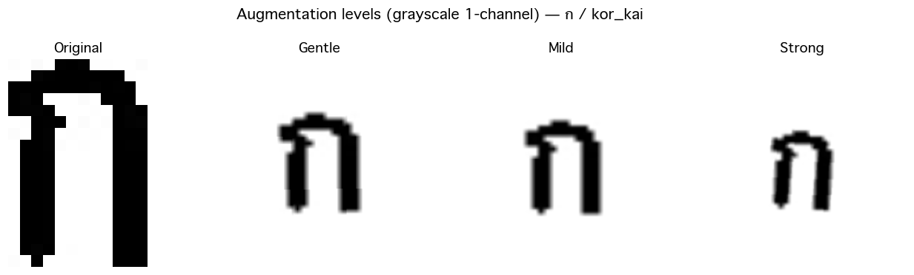

# 🔤 Thai Character Recognition — Transfer Learning

จำแนก**ตัวอักษร / ตัวเลข / วรรณยุกต์ไทย 72 คลาส** จากภาพลายมือ ด้วย Transfer Learning
เปรียบเทียบ 3 สถาปัตยกรรม: **ResNet50**, **EfficientNet-B3**, **MobileNetV3-Large**

โครงการนี้เกิดจากความสนใจเรื่อง OCR ภาษาไทย ซึ่งมีความท้าทายเฉพาะตัวที่ภาษาอังกฤษไม่มี — สระและวรรณยุกต์ที่วางซ้อนกันได้หลายชั้น (บน-กลาง-ล่างของตัวพยัญชนะ) และตัวอักษรหลายคู่ที่หน้าตาคล้ายกันมาก (เช่น ฒ/ฐ/ถ) ทำให้เป็นงาน image classification ที่น่าสนใจกว่าตัวอักษรละตินทั่วไป งานนี้เปรียบเทียบว่าสถาปัตยกรรม CNN แบบ transfer learning 3 ตัวจัดการกับความท้าทายนี้ได้ดีแค่ไหน

ภาพ input เป็น **grayscale 1 channel** (อักษรไทยไม่พึ่งสี) โมเดล pretrained บน ImageNet
ถูกแก้ Conv layer แรกให้รับ 1 channel และเปลี่ยนหัว classifier เป็น 72 คลาส

---

## 📁 โครงสร้างโปรเจกต์

```
round2/
├── Samlong.ipynb          # notebook orchestrator (เรียกใช้ src/)
├── class_mapping.json     # folder name ↔ ตัวอักษรไทย (72 คลาส)
├── requirements.txt
├── src/
│   ├── dataset.py         # transforms, stratified split, ThaiCharDataset
│   ├── model.py           # create_model(), get_device()
│   ├── train.py           # train_model(), evaluate(), run() + CLI
│   └── predict.py         # test_single_image() — inference
├── <class_name>/          # โฟลเดอร์ภาพต่อคลาส (gitignored) เช่น kor_kai/, sara_aa/
└── outputs_<model>/       # ผลลัพธ์หลังเทรน (gitignored)
```

## 🗂️ Dataset

<p align="center">
  
  <br>
  <em>ตัวอย่างจริงจาก dataset — 1 รูปต่อคลาส ครบทั้ง 72 คลาส (ตัวอักษร / ตัวเลข / วรรณยุกต์ไทย, grayscale)</em>
</p>

จัดภาพเป็น `<class_name>/<image>.jpg` โดย `<class_name>` ตรงกับ key ใน `class_mapping.json`:

```
kor_kai/0001.jpg      # ก
kor_kai/0002.jpg
khor_khai/0001.jpg    # ข
sara_aa/0001.jpg      # า
...
```

- รองรับนามสกุล `.jpg .jpeg .png .bmp .gif`
- `src/dataset.py` อ่าน **เฉพาะ 72 โฟลเดอร์ที่ระบุใน `class_mapping.json`** จึงไม่หลงไปนับ `outputs_*/`, `src/`
- แบ่ง **train/val/test = 80/10/10 แบบ stratified per-class** (seed=42) ทุกคลาสมีตัวแทนในทุก split
- โฟลเดอร์ภาพถูก gitignore (ใหญ่ ~62k รูป) — เตรียม dataset เองก่อนเทรน

> 📌 **ที่มาของ dataset:** ได้รับไฟล์ภาพมาจากแหล่งภายใน (เพื่อนในมหาวิทยาลัย) ไม่ทราบ
> แหล่งที่มาดั้งเดิมหรือ license ที่แน่ชัด โฟลเดอร์เดิมตั้งชื่อเป็นตัวเลข (161–249) โดยไม่มี
> mapping ไปสู่ตัวอักษรไทยมาด้วย — ชื่อโฟลเดอร์ทั้ง 72 ในเวอร์ชันนี้ถูกตั้งขึ้นใหม่จากการ
> เปิดดูภาพด้วยตาเอง หากท่านใดเป็นผู้ถือสิทธิ์ของ dataset ต้นทางนี้ กรุณาติดต่อเพื่อระบุ
> แหล่งที่มาและ license ให้ถูกต้อง

> ⚠️ **หมายเหตุเรื่อง label:** ชื่อโฟลเดอร์ทั้ง 72 ถูกตั้งจากการดูภาพด้วยตา
> มีเพียง 5 ตัวที่ยืนยันจากภาพจริงแน่นอน (`paiyannoi`, `mai_han_akat`, `lak_khang`,
> `mai_yamok`, `mai_taikhu`) ควรสุ่มตรวจกลุ่มที่สับสนง่าย
> (`tor_phutao`, `thor_thung`, `thor_than`, `sor_rusi`, `ror_ruesi`, `lor_chula_2`)
> ก่อนนำผลไปใช้จริงจัง
>
> ⚠️ บางคลาสมีภาพน้อยมาก (`khor_khuat`=1, `tor_montho`=1, `lor_chula_2`=3, `lek_thai_7`=4)
> — stratified split จะใส่ไว้ใน train เป็นหลัก ผลทำนายคลาสเหล่านี้จึงเชื่อถือได้น้อย

## ⚙️ ติดตั้ง

```bash
pip install -r requirements.txt
```

versions ถูก pin ตามเครื่องที่เทรนจริง (Apple Silicon / MPS) — บนเครื่อง CUDA
ให้ติดตั้ง torch/torchvision build ที่ตรงกับ CUDA จาก https://pytorch.org

## 🚀 เทรน

```bash
# เทรนทั้ง 3 โมเดล (เพดาน 10 epoch, early stopping + ReduceLROnPlateau)
python -m src.train --models all --epochs 10 --augment single

# เทรนตัวเดียว
python -m src.train --models efficientnet_b3 --epochs 15

# smoke test เร็ว ๆ (จำกัดภาพต่อคลาส)
python -m src.train --models mobilenet_v3 --epochs 1 --max-per-class 20
```

ตัวเลือก augment:
- `single` (default) — สุ่ม 1 ระดับ augment ต่อภาพ (เร็ว)
- `triple` — augment ครบ 3 ระดับ (gentle/mild/strong) ดาต้า ×3 (ช้ากว่า ~3 เท่า)

<p align="center">
  
  <br>
  <em>3 ระดับ augmentation จากภาพต้นฉบับ (grayscale 1-channel + Normalize(0.5, 0.5))</em>
</p>

ผลลัพธ์เซฟที่ `outputs_<model>/` (`*_best.pt`, `training_history.json`,
`classification_report_*.json`) และสรุปรวมที่ `results_summary.json`

## 🔮 ทำนายภาพเดียว

```bash
python -m src.predict path/to/image.jpg --model efficientnet_b3
```

หรือใน Python / notebook:

```python
from src.predict import test_single_image
res = test_single_image("kor_kai/0001.jpg", model_name="efficientnet_b3", topk=3)
print(res["predicted_char"], res["confidence"])
```

## 📊 ผลลัพธ์ (Test Set)

> เทรนด้วย: 10 epoch (เพดาน), augment=single, batch=32, Adam lr=1e-3,
> early stopping (patience 4) + ReduceLROnPlateau, device=MPS
> ตัวเลขดึงจาก `results_summary.json` ของการรันจริง

<!-- RESULTS_TABLE -->
| Model | Test Accuracy | Macro F1 | Best Val Acc | Epochs |
|---|---|---|---|---|
| ResNet50 | 97.79% | 0.9780 | 98.23% | 10 |
| EfficientNet-B3 | 97.63% | 0.9592 | 97.96% | 10 |
| MobileNetV3-Large | 96.59% | 0.9238 | 97.11% | 10 |
<!-- /RESULTS_TABLE -->

## 📝 หมายเหตุ

- การเทรนบน MPS (ไม่มี GPU/CUDA) ใช้เวลานาน — ResNet50 ~16 นาที/epoch
- ใช้ stratified split + seed คงที่ → reproducible
- รัน notebook ได้แบบ Restart & Run All (เซลล์เทรนถูก guard ด้วย `RUN_TRAINING=False`)
